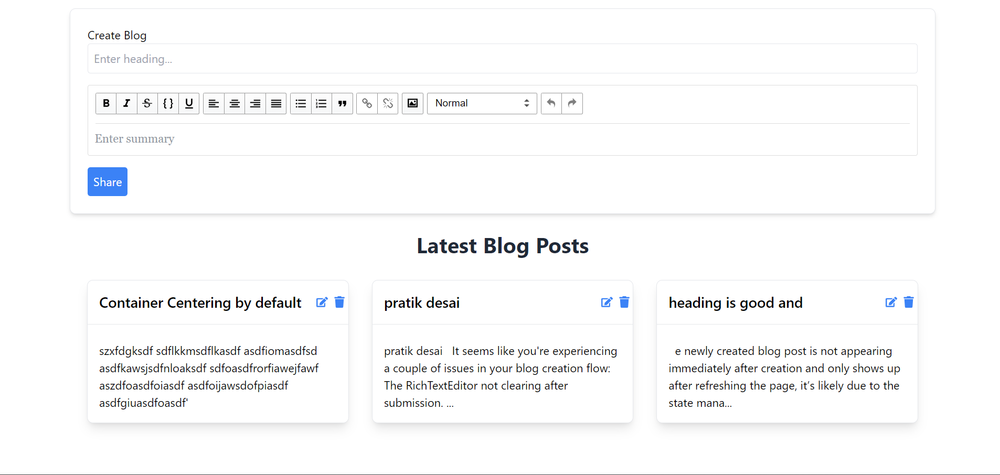

# Blog Post (MERN app)

## Available Scripts




## Project Overview

This Blog Application is a full-stack web project built using React for the frontend and Express with MongoDB for the backend. It allows users to create, edit, view, and delete blog posts, with the content formatted using a rich text editor. The project is designed to be modular, with separate backend and frontend structures for easier scalability and development.

## Features

- Create Blog Posts: Users can write blog posts using a rich text editor, format content, and upload images.

- Edit and Update Posts: Users can modify their existing blog posts.
- Delete Posts: Users can delete posts with a simple action.
- View All Posts: Displays a list of blog posts with rich media content.
- Single Post View: Click on any blog title to view the complete post in a dedicated view.
- Responsive Design: The frontend is styled using Tailwind CSS for a modern and responsive UI.
- Real-time Updates: After creating, editing, or deleting a blog post, changes are reflected in the blog feed without requiring a page refresh.

### Tech Stack

#### Frontend

- React: Used for creating dynamic user interfaces.
- Axios: For handling HTTP requests between the frontend and backend.
- Tailwind CSS: For responsive, modern, and clean UI design.
- React RTE: Rich text editor for composing blog posts.

#### Backend

- Express: Backend framework to handle API requests.
- MongoDB: NoSQL database for storing blog post data.
- Mongoose: ODM for MongoDB to define blog post schemas.
- Cors: Middleware for handling Cross-Origin Resource Sharing.
- Dotenv: For managing environment variables like MongoDB connection strings.

### Project Structure

- The project is divided into two main folders:

#### frontend/: Contains all React-related code.

Components: GetBlog.js and RichTextEditorComponent.js manage blog retrieval and post creation.
backend/: Handles server-side operations, API routes, and database interactions.
Controllers: Defines logic for creating, editing, retrieving, and deleting blog posts.
Models: Mongoose models for blog posts.
Routes: API routes for interacting with the database.

#### Key Functionality

Blog Creation: Users can create rich-text blog posts with formatted text and embedded images.
Edit Blog Post: Users can edit their blog posts, including updating text and images.
Delete Blog Post: Users can delete blog posts, which will reflect instantly on the frontend.
Single Page Navigation: Navigate between blog list and single blog view using the react-router-dom library.

### How to Run the Project

Clone the Repository:

```
git clone https://github.com/your-repository-url
```

### Navigate to Frontend:

```
cd frontend
npm install
```

### Navigate to Backend:

```
cd ../backend
npm install
```

### Start the Development Servers:

#### Start the frontend:
```
cd frontend
npm start
```

#### Start the backend:
```
cd backend
npm run dev
```
#### Access the Application: The app will be available at http://localhost:3000/ for the frontend and https://blog-post-hseq.onrender.com/api/v1/blog for the backend.Project Overview
